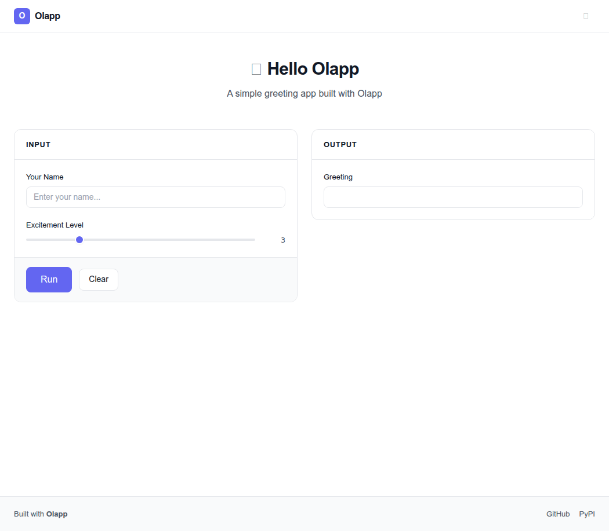

<p align="center">
  
</p>

<p align="center">
  <strong>A modern alternative to Gradio. Build ML demos and web apps with Python.</strong>
</p>

<p align="center">
  <a href="https://pypi.org/project/olapp/"></a>
  <a href="https://pypi.org/project/olapp/"></a>
  <a href="LICENSE"></a>
  <a href="https://github.com/Atum246/olapp/actions"></a>
</p>

---

<p align="center">
  
</p>

## Why Olapp?

- **Clean, professional UI** — not generic AI styling. Looks like a real product.
- **Simple API** — `Interface` for quick demos, `Blocks` for complex layouts
- **25 components** — Textbox, Slider, Image, Chatbot, Code, Gallery, and more
- **Real-time streaming** — SSE-based live updates
- **Dark/light themes** — built-in, no config needed
- **HuggingFace Spaces compatible** — drop in `app.py` and go

## Install

```bash
pip install olapp
```

## Quick Start

```python
import olapp

def greet(name, excitement):
    return f"Hello, {name}{'!' * int(excitement)}"

app = olapp.Interface(
    fn=greet,
    inputs=[
        olapp.Textbox(label="Name", placeholder="Enter your name"),
        olapp.Slider(minimum=1, maximum=10, value=3, label="Excitement"),
    ],
    outputs=olapp.Textbox(label="Greeting"),
    title="Greeter",
)
app.launch()
```

## Blocks API

```python
import olapp

with olapp.Blocks(title="My App") as app:
    with olapp.Row():
        inp = olapp.Textbox(label="Input")
        out = olapp.Textbox(label="Output")
    btn = olapp.Button("Run")
    app.click(fn=lambda x: x.upper(), inputs=inp, outputs=out)

app.launch()
```

## Components

| Component | Description |
|-----------|-------------|
| `Textbox` | Single/multi-line text input |
| `Number` | Numeric input with +/- controls |
| `Slider` | Range slider |
| `Checkbox` | Boolean toggle |
| `Dropdown` | Selection dropdown |
| `Radio` | Radio button group |
| `Button` | Clickable button |
| `Image` | Image upload with drag & drop |
| `Audio` | Audio upload & playback |
| `Video` | Video upload & playback |
| `File` | File upload |
| `Dataframe` | Tabular data display |
| `Markdown` | Markdown renderer |
| `HTML` | Raw HTML display |
| `Chatbot` | Chat message interface |
| `State` | Hidden state storage |
| `ColorPicker` | Color picker with hex input |
| `DateTime` | Date/time picker |
| `Code` | Code editor with monospace font |
| `Gallery` | Image gallery grid |
| `Label` | Classification labels with confidence bars |
| `HighlightedText` | Text with labeled spans (NER, sentiment) |
| `JSON` | JSON viewer |
| `Progress` | Progress bar |

## Color Theme

Olapp uses a clean, professional color palette:

| Token | Light | Dark | Usage |
|-------|-------|------|-------|
| Primary | `#6366f1` | `#818cf8` | Buttons, links, accents |
| Success | `#059669` | `#059669` | Success states |
| Warning | `#d97706` | `#d97706` | Warning states |
| Error | `#dc2626` | `#dc2626` | Error states |
| Background | `#ffffff` | `#030712` | Page background |
| Surface | `#ffffff` | `#111827` | Card backgrounds |
| Border | `#e5e7eb` | `#1f2937` | Borders and dividers |
| Text | `#111827` | `#f9fafb` | Primary text |
| Text Secondary | `#4b5563` | `#9ca3af` | Secondary text |

## Layout (Blocks)

```python
with olapp.Blocks(title="Complex App") as app:
    with olapp.Row():
        with olapp.Column():
            inp = olapp.Textbox(label="Input")
        with olapp.Column():
            out = olapp.Textbox(label="Output")

    with olapp.Group():
        btn = olapp.Button("Process")
        app.click(fn=process, inputs=inp, outputs=out)

    with olapp.Tabs():
        with olapp.Tab("Results"):
            olapp.Markdown(value="Results here")
        with olapp.Tab("Settings"):
            olapp.Slider(label="Threshold", minimum=0, maximum=1, value=0.5)
```

## HuggingFace Spaces

Create `app.py`:

```python
import olapp

def predict(text):
    return text[::-1]

app = olapp.Interface(fn=predict, inputs="textbox", outputs="textbox", title="Reverser")
app.launch(server_name="0.0.0.0", server_port=7860)
```

`requirements.txt`:
```
olapp
```

## Development

```bash
git clone https://github.com/Atum246/olapp.git
cd olapp
pip install -e .
python -m pytest tests/ -v
```

## License

MIT
